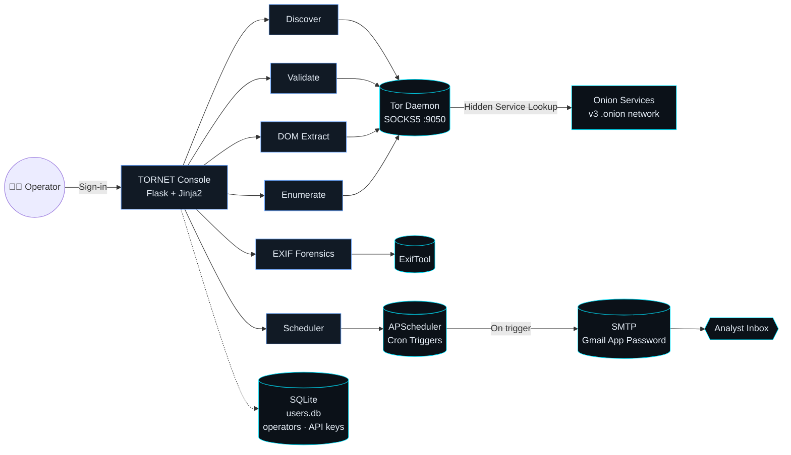
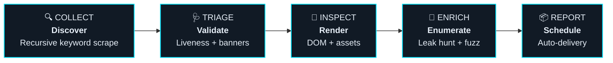
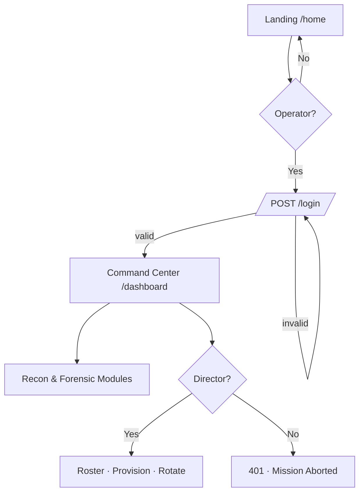

<div align="center">

# `TORNET GRANTED`

### Dark-Web Intelligence &amp; Onion-Service Reconnaissance Platform

*Illuminate the unindexed web. Hunt threats at the source.*

<br/>


<br/>

[`Mission`](#-mission) ·
[`Capabilities`](#-capability-matrix) ·
[`Architecture`](#-architecture) ·
[`Install`](#-installation) ·
[`Modules`](#-intelligence-modules) ·
[`Workflow`](#-analyst-workflow) ·
[`Ethics`](#-ethical-use-policy)

</div>

---

## 🎯 Mission

**TORNET GRANTED** is an intelligence-grade reconnaissance platform that
discovers, validates, renders and enumerates Tor hidden services — turning the
noise of the dark web into structured, attributable signal for analysts,
investigators and defenders.

It was originally built in response to *Problem Statement PSID-1455* of the
**Smart India Hackathon 2023**, and has since matured into an open-source
tactical console that operators can deploy on a single host — entirely
self-contained, air-gappable, and fully attributable to a single operator
identity per session.

> The Onion Routing network provides legitimate anonymity to journalists,
> activists, and at-risk users. It is also abused by threat actors. The
> defensive cyber community needs lightweight tooling to **observe**,
> **catalogue**, and **report on** that abuse — without participating in it.

---

## ⚡ Why TORNET GRANTED?

|  | Most OSINT Tools | **TORNET GRANTED** |
|---|---|---|
| **Tor-native collection** | Optional add-on | First-class. Every request egresses over the local Tor SOCKS5 circuit. |
| **Unified workflow** | One tool per task | Six tightly-integrated modules in a single console. |
| **Self-hosted** | Cloud SaaS w/ telemetry | Drop on a single host. Zero outbound telemetry. |
| **Operator-attributable** | Anonymous bulk runs | Every artefact traceable to an operator session. |
| **Scheduled collection** | Manual or external cron | Built-in mission scheduler with SMTP delivery. |
| **Forensic media support** | Separate ExifTool wrapper | EXIF intelligence integrated with leak hunting. |

---

## 🧠 Capability Matrix

| # | Module | Purpose | Surfaces |
|---|---|---|---|
| 01 | **Discover Onion URLs** | Recursive multi-engine scraping of dark-web indexers by keyword. | Catalogued `.onion` endpoints, exportable as TXT/JSON/PDF |
| 02 | **Validate Hidden Services** | Liveness probing for single or bulk targets through SOCKS5. | Active / Dead segmentation, response headers, server banners |
| 03 | **DOM Extraction** | Static fetch &amp; render of the document model of any hidden service. | Source markup, asset references, embedded artefacts |
| 04 | **Enumerate &amp; Fingerprint** | Regex-driven leak hunt + fuzzing of common configuration paths. | Credentials, crypto wallets, emails, domain references, `/.env` leaks |
| 05 | **EXIF / Media Forensics** | Hidden metadata extraction from images and media. | GPS, device fingerprints, embedded comments, timestamps |
| 06 | **Mission Scheduler** | Cron-style recurring or one-shot operation queueing. | Automated delivery of intelligence digests via SMTP |

---

## 🏗 Architecture


```mermaid
flowchart LR
    Operator((🧑‍✈️ Operator)) -->|Sign-in| Console[TORNET Console<br/>Flask + Jinja2]
    Console --> ModDis[Discover]
    Console --> ModVal[Validate]
    Console --> ModDom[DOM Extract]
    Console --> ModEnu[Enumerate]
    Console --> ModExi[EXIF Forensics]
    Console --> ModSch[Scheduler]

    ModDis & ModVal & ModDom & ModEnu --> Tor[(Tor Daemon<br/>SOCKS5 :9050)]
    Tor -->|Hidden Service Lookup| Hidden[Onion Services<br/>v3 .onion network]

    ModExi --> ExifTool[(ExifTool)]
    ModSch --> APS[(APScheduler<br/>Cron Triggers)]
    APS -->|On trigger| Mail[(SMTP<br/>Gmail App Password)]
    Mail --> Inbox{{Analyst Inbox}}

    Console -.-> DB[(SQLite<br/>users.db<br/>operators · API keys)]

    classDef ext fill:#0b1118,stroke:#00e5ff,color:#e6eef7,stroke-width:1px;
    classDef core fill:#111a25,stroke:#6aa6ff,color:#e6eef7,stroke-width:1px;
    class Console,ModDis,ModVal,ModDom,ModEnu,ModExi,ModSch core
    class Tor,ExifTool,APS,Mail,DB,Hidden,Inbox ext
```

**Design tenets**

- **Single binary host.** Python 3 + Flask + SQLite. No external services required for collection.
- **Tor-only egress.** All recon traffic is routed through the local Tor SOCKS5 proxy (`127.0.0.1:9050`).
- **Operator-attributable.** Every session is bound to an authenticated operator identity stored in `users.db`.
- **Pluggable export.** Findings can be exported as `TXT`, `JSON` or analyst-ready `PDF`.

---

## 🛰 Analyst Workflow


```mermaid
flowchart LR
    A[🔍 COLLECT<br/><b>Discover</b><br/>Recursive keyword scrape] --> B[🩺 TRIAGE<br/><b>Validate</b><br/>Liveness + banners]
    B --> C[📄 INSPECT<br/><b>Render</b><br/>DOM + assets]
    C --> D[💎 ENRICH<br/><b>Enumerate</b><br/>Leak hunt + fuzz]
    D --> E[📦 REPORT<br/><b>Schedule</b><br/>Auto-delivery]

    classDef step fill:#111a25,stroke:#00e5ff,color:#e6eef7,stroke-width:1.5px;
    class A,B,C,D,E step
```

1. **Collect** — issue a keyword query at a chosen recursion depth.
2. **Triage** — bulk-probe the catalogued endpoints to segment active vs. dead pools.
3. **Inspect** — render the DOM of high-priority targets for manual review.
4. **Enrich** — run regex-driven leak hunting and fuzz for misconfigurations.
5. **Report** — schedule recurring collection and dispatch intelligence digests by email.

---

## 📦 Installation

### Prerequisites

| Component | Purpose |
|---|---|
| Python **3.9+** | Runtime |
| **Tor daemon** | SOCKS5 egress for all collection |
| **ExifTool** | Media metadata extraction |

### Linux / macOS

```bash
git clone https://github.com/prakhar0x01/Tornet_Granted.git
cd Tornet_Granted
pip install -r requirements.txt

# Install supporting binaries
sudo apt install tor exiftool          # Debian / Ubuntu
brew install tor exiftool              # macOS (Homebrew)

# Start the Tor daemon (SOCKS5 on 127.0.0.1:9050)
sudo systemctl start tor               # systemd
# — or —
sudo service tor start
```

### Windows

```powershell
git clone https://github.com/prakhar0x01/Tornet_Granted.git
cd Tornet_Granted
pip install -r requirements.txt
```

Then install the Windows binaries from:

- Tor → <https://www.torproject.org/download/tor/>
- ExifTool → <https://exiftool.org/>

### Launch the console

```bash
python app.py
```

Open the operator console at **<http://127.0.0.1:5000/>** and authenticate.

> 🛂 **Bootstrap director credentials** — `admin` / `admin`. Rotate immediately
> from the Administration → Credentials panel on first sign-in.

---

## 🔐 Authentication Model


```mermaid
flowchart TD
    L[Landing /home] --> S{Operator?}
    S -- No --> L
    S -- Yes --> Auth[/POST /login/]
    Auth -->|valid| D[Command Center /dashboard]
    Auth -->|invalid| Auth
    D --> Modules[Recon &amp; Forensic Modules]
    D --> Adm{Director?}
    Adm -- Yes --> AdmPanel[Roster · Provision · Rotate]
    Adm -- No --> Un[401 · Mission Aborted]
```

- The console **does not allow self-registration.**
- Only the **`admin`** director can provision new operators or rotate credentials.
- All credentials are stored as **SHA-256 digests** in SQLite (`instance/users.db`).
- Every operator is issued a stateless `TORNET…` API key and a 40-char secret access key.

---

## 🧪 Intelligence Modules

### 01 · Discover Onion URLs

Recursive scraping of dark-web indexers for keyword-relevant hidden services.

- Search by keyword (e.g. `markets`, `leaks`, `crypto`, `forums`)
- Tune **recursion depth** (1–5) to balance breadth and runtime
- Export the catalogue as `TXT`, `JSON`, or analyst-ready `PDF`

> ⚠ Higher depths **exponentially** increase runtime. Depths ≥ 3 may take
> several minutes per circuit depending on ISP, network conditions and target
> latency.

### 02 · Validate Hidden Services

Single-shot or bulk-upload validation of `.onion` endpoints through Tor SOCKS5.

- **Single-target probe** — returns response code &amp; full HTTP headers
- **Bulk probe** — `.txt` upload, one URL per line
- Active/Dead segmentation with exportable report

### 03 · DOM Extraction

Static fetch of the document model of any hidden service.

- Useful for inspecting markup, asset references, embedded scripts, obfuscated payloads
- No JavaScript execution on the target — purely static fetch over Tor
- Syntax-highlighted source view (highlight.js · Atom One Dark)

### 04 · Enumerate &amp; Fingerprint

Regex-driven leak detection plus guided fuzzing of common configuration paths.

| Category | Severity | Why it matters |
|---|---|---|
| Plaintext credentials | 🔴 CRITICAL | Direct operator access |
| Exposed `.env` / `.git` | 🔴 CRITICAL | Server attribution |
| Clearnet domain references | 🟠 HIGH | Pivot to clearnet infra |
| Crypto wallet addresses | 🟡 MEDIUM | Financial attribution |
| Email / contact vectors | 🟡 MEDIUM | Operator OPSEC failure |
| Usernames | 🔵 LOW | Persona linkage |

> 💡 *Why fuzz for server config?* Historical OPSEC failures (e.g. **Silk Road**,
> **AlphaBay**) often stemmed from misconfigured `phpinfo()` pages, exposed
> `.git` directories, or default server-status endpoints. The Fuzz toggle
> walks the platform wordlist (`internal/wordlists.txt`) for these vectors.

### 05 · EXIF / Media Forensics

Metadata extraction from media artefacts collected from dark-web sources.

- GPS coordinates, device make/model, software signatures
- `DateTimeOriginal`, `UserComment`, embedded thumbnail data
- All analysis happens **locally** — artefacts are never uploaded externally

> 💡 *Why this matters.* Adversaries communicating over dark-web chat rooms
> frequently exchange media files. Hidden EXIF metadata has historically
> exposed real-world geolocations and devices.

### 06 · Mission Scheduler

Cron-style scheduling of recurring reconnaissance.

- Schedule discovery operations by date/time
- Results delivered automatically via **SMTP** to a recipient inbox
- Powered by [APScheduler](https://apscheduler.readthedocs.io/)

> 📨 SMTP delivery requires Gmail credentials in `config.txt`:
> ```ini
> email=youraddress@gmail.com
> password=your-16-char-gmail-app-password
> ```
> [Create a Gmail App Password →](https://support.google.com/accounts/answer/185833)

---

## 🛠 Tech Stack

| Layer | Technology |
|---|---|
| Runtime | **Python 3.9+** |
| Web framework | **Flask** · Jinja2 templates |
| Sessions | **Flask-Login** |
| Persistence | **SQLite 3** via Flask-SQLAlchemy |
| Scheduling | **APScheduler** (BackgroundScheduler + CronTrigger) |
| Anonymous egress | **Tor daemon** · SOCKS5 `127.0.0.1:9050` |
| HTTP | **Requests** + SOCKS adapter |
| DOM parsing | **BeautifulSoup 4** |
| Forensics | **ExifTool** |
| Reporting | **ReportLab** (PDF) |
| Crypto | **pyOpenSSL** · `hashlib` SHA-256 |
| Frontend | Vanilla CSS design system · zero build step |

---

## 🗂 Project Layout

```
Tornet_Granted/
├── app.py                       # Flask routes, models, scheduler
├── config.txt                   # SMTP credentials (Gmail App Password)
├── requirements.txt
├── instance/
│   └── users.db                 # SQLite operator store
├── internal/
│   ├── wordlists.txt            # Fuzz wordlist
│   ├── discover/                # Discovery scratch space
│   ├── validate/                # Validation scratch space
│   ├── details/                 # Enumeration scratch space
│   └── uploads/                 # EXIF artefact uploads
├── static/                      # Design system + assets
│   ├── css/
│   │   ├── tokens.css           # Color, type, spacing tokens
│   │   ├── components.css       # Buttons, cards, tables, pills
│   │   └── app.css              # Console shell layout
│   ├── js/app.js                # UI helpers (toast, copy, dropzone, hero net)
│   └── img/
└── templates/
    ├── base.html                # Shell extending all pages
    ├── partials/
    │   ├── _brand.html
    │   ├── _sidebar.html
    │   └── _topbar.html
    ├── pages/
    │   └── landing.html         # Public marketing page (/home)
    ├── login.html               # Operator sign-in
    ├── dashboard.html           # Command Center
    ├── discover.html            # Module 01
    ├── validate.html            # Module 02
    ├── render.html              # Module 03
    ├── details.html             # Module 04
    ├── metadata.html            # Module 05
    ├── schedule.html            # Module 06
    ├── users.html               # Admin · Operator Roster
    ├── add_user.html            # Admin · Provision Operator
    ├── update_user.html         # Admin · Rotate Credential
    └── unauthorize.html         # 401 · Mission Aborted
```

---

## 🎛 Operational Use Cases

<table>
<tr>
<td width="33%" valign="top">

### 🛡 Threat Intelligence
Track emergence of new marketplaces, leak forums, and ransomware blogs.
Establish persistent collection on adversary infrastructure.

</td>
<td width="33%" valign="top">

### 🔬 Digital Forensics
Identify operators exposed through metadata, server misconfigurations, leaked
`.git` directories, or unredacted EXIF in posted imagery.

</td>
<td width="33%" valign="top">

### 🏢 Brand Protection
Detect brand impersonation, leaked customer data, and unauthorised resale of
corporate intellectual property on hidden services.

</td>
</tr>
<tr>
<td width="33%" valign="top">

### 🚨 CSIRT / Blue Team
Pivot from observed indicators (Bitcoin addresses, contact emails, PGP keys)
to attribute infrastructure across the hidden web.

</td>
<td width="33%" valign="top">

### 🎓 Academic Research
Longitudinal datasets of hidden service availability, content categorisation,
and topology of the v3 onion graph.

</td>
<td width="33%" valign="top">

### ⚖️ Authorised Investigation
Structured evidence collection workflows with operator-attributable audit
trails for accredited investigative units.

</td>
</tr>
</table>

---

## 🤝 Contributing

Contributions from the community are very welcome.

<details>
<summary><strong>Ways to contribute</strong></summary>

### 💻 Code
- Fork the repository, branch from `main`, submit a PR.
- Match the existing code style and add tests where practical.
- Open an issue first for non-trivial features so we can align on scope.

### 🐛 Bug reports
- Include reproduction steps, expected vs. actual, and any logs.
- Tag with the affected module (e.g. `discover`, `validate`, `scheduler`).

### 📝 Documentation
- README clarifications, in-app copy improvements, architectural diagrams.
- New analyst playbooks for specific investigative scenarios.

### 🧪 Testing
- Run the platform against synthetic / authorised test corpora.
- Report observed false-positives / false-negatives in the enumeration regexes.

</details>

---

## 🔒 Security &amp; Disclosure

If you discover a vulnerability in TORNET GRANTED, please **do not** open a
public issue. Email the maintainer privately and allow a reasonable window for
remediation before public disclosure.

Known design considerations and explicit non-goals:

- The platform **does not** attempt to deanonymise the Tor network itself or its users.
- The fuzz module operates **only** against a target the operator explicitly submits.
- Bootstrap credentials (`admin/admin`) **must** be rotated before any non-trivial deployment.
- The session-only username check on admin routes is intentional for a self-hosted single-operator deployment — harden before multi-tenant use.

---

## 🧭 Ethical Use Policy

TORNET GRANTED is built and distributed for:

- ✅ Defensive cyber-security research
- ✅ Authorised threat intelligence collection
- ✅ Academic study of dark-web ecosystems
- ✅ Brand-protection &amp; takedown enablement
- ✅ Law-enforcement use in lawful jurisdictions

It is **not** built for, and **must not** be used for:

- ❌ Unauthorised access to systems
- ❌ Harvesting illegal content
- ❌ Harassment, doxing, or stalking
- ❌ Circumvention of platform terms in jurisdictions where doing so is unlawful

Operators are solely responsible for ensuring all collection complies with
local legislation, organisational policy, and the terms of any external
services interacted with. The maintainers disclaim liability for misuse.

---

## 🗺 Roadmap

- [ ] **Scheduler v2** — extend automation to Validate, Render, and Enumerate modules.
- [ ] **Findings store** — persistent SQLite-backed catalogue with operator-tagged history.
- [ ] **API** — first-class REST endpoints authenticated via the existing API/secret keypair.
- [ ] **Operator roles** — beyond `admin` / `analyst`, fine-grained capability tiers.
- [ ] **Threat-actor graph** — pivot between artefacts (wallets ↔ onions ↔ emails).
- [ ] **Headless rendering** — opt-in JS-rendered DOM capture for dynamic onions.

---

## 📚 Resources

- [Using Python to monitor the dark web](https://www.digitalforensicstips.com/2023/01/using-python-to-monitor-onion-dark-web.html)
- [Dark web scraping using Python](https://hoxframework.com.hr/?p=473)
- [Is Tor still anonymous?](https://youtu.be/-uDYvy2jQzM)
- [The Edward Snowden TOR STINKS slides](https://www.theguardian.com/world/interactive/2013/oct/04/tor-stinks-nsa-presentation-document)
- [DEFCON 22 · How people got caught](https://youtu.be/eQ2OZKitRwc)
- [DEFCON 22 · Touring the Darkside of the Internet](https://youtu.be/To5yarfAg_E)
- [Bad OPSEC · How Tor users got caught](https://youtu.be/GR_U0G-QGA0)
- [Deanonymisation of Tor HTTP hidden services](https://www.youtube.com/watch?v=v45_tkKCJ54)
- [Uncovering Tor hidden services with ETag](https://sh1ttykids.medium.com/new-techniques-uncovering-tor-hidden-service-with-etag-5249044a0e9d)

---

## 📜 License

Distributed under the **MIT License**. See `LICENSE` for full text.

---

<div align="center">

<sub>Built with focus by <a href="https://github.com/prakhar0x01"><strong>@prakhar0x01</strong></a> · v2.0 Tactical Edition</sub>

</div>
